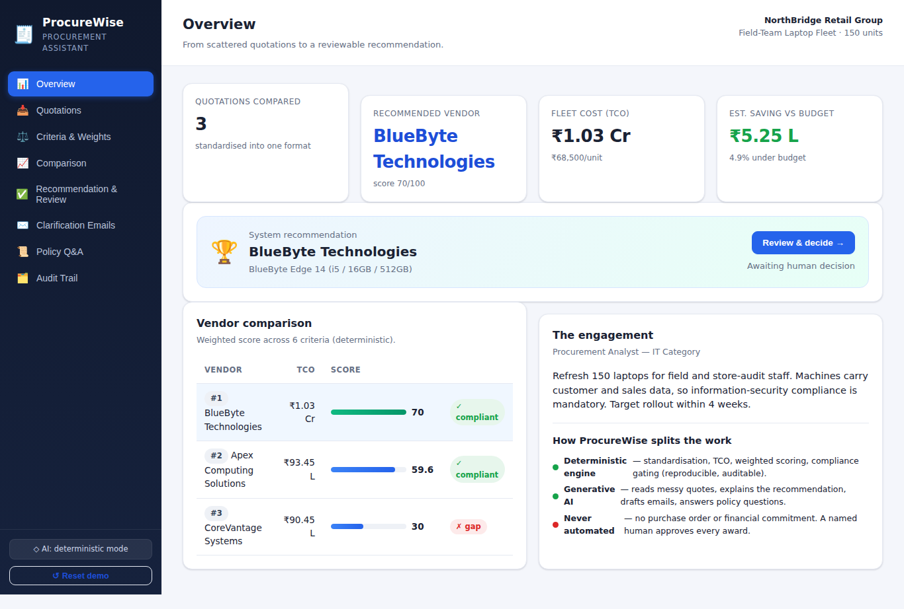
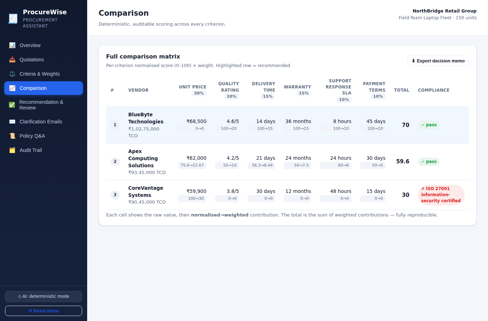
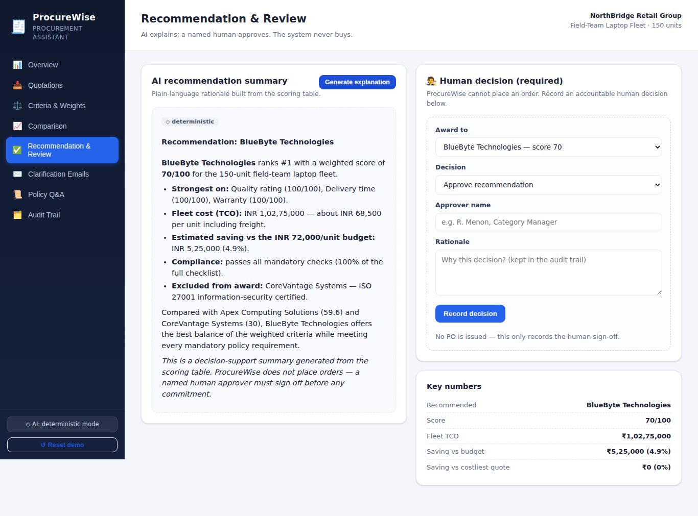
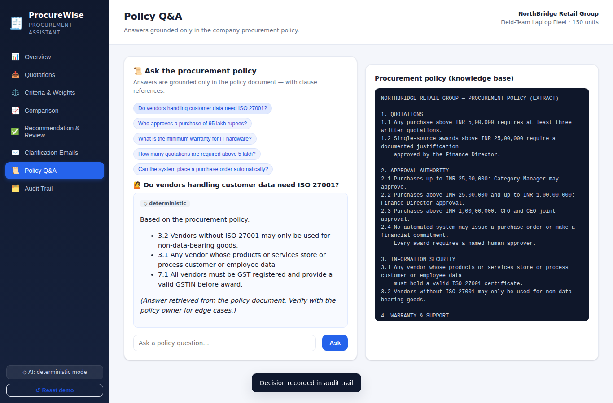
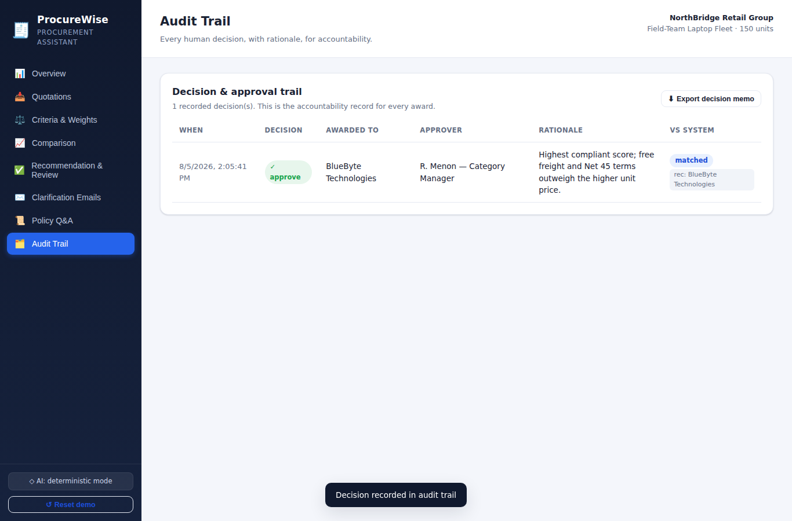

# ProcureWise — Vendor Comparison & Procurement Assistant

> **Gen AI for Business — Capstone Project · Topic 04**
> A working decision-support tool that turns messy vendor quotations into a
> transparent, auditable, **human-approved** procurement recommendation.



---

## 1. The business problem

Buyers receive quotations in inconsistent formats (emails, PDFs, spreadsheets),
compare them by hand in ad-hoc spreadsheets, and often can't show *why* one
vendor was chosen. Compliance checks (security certification, warranty minimums,
tax registration) are easy to miss, and there is rarely a clean record of who
approved an award and why.

**Scenario used in the demo (fictional):** *NorthBridge Retail Group* is buying
**150 laptops** for field staff. Three vendors have quoted, in three different
formats. The machines hold customer data, so **ISO 27001** security
certification is mandatory.

## 2. What ProcureWise does

A single working journey, from raw input to a useful, reviewable output:

1. **Standardise** — paste any quote (email / PDF text / spreadsheet dump); AI
   extracts it into one comparable structure.
2. **Score** — a *deterministic* engine normalises every criterion, applies the
   buyer's weights, computes Total Cost of Ownership, and ranks vendors.
3. **Gate on compliance** — a vendor that fails a mandatory policy check (e.g.
   no ISO 27001) is never recommended, even if it is cheapest.
4. **Explain** — AI writes a plain-language rationale from the scoring table.
5. **Review & decide** — a **named human** approves, overrides, or rejects. The
   system **never places an order**.
6. **Communicate** — AI drafts clarification/negotiation emails and answers
   procurement-policy questions grounded in the policy document.
7. **Audit** — every decision is logged with approver and rationale, and an
   exportable decision memo is produced.

## 3. Where Gen AI adds value vs. where deterministic logic is used

This split is deliberate and is a core requirement of the brief.

| Concern | Handled by | Why |
|---|---|---|
| Reading messy free-text quotes | **Gen AI** (Claude) | Natural-language variety |
| Explaining the recommendation | **Gen AI** | Fluent business communication |
| Drafting vendor emails | **Gen AI** | Tone and phrasing |
| Policy Q&A | **Gen AI** (grounded in policy) | Language understanding |
| Normalisation, TCO, weighted score, ranking | **Deterministic** (`server/scoring.js`) | Must be reproducible & auditable |
| Compliance gating | **Deterministic** | Rules, not judgement |
| Placing an order / financial commitment | **Nobody automated** | A human must approve |

Every AI-generated block in the UI is labelled with the mode that produced it
(**⚡ Claude** or **◇ deterministic**), so a reviewer always knows the source.

## 4. Run it

**Requirements:** Node.js ≥ 18. No dependencies to install — the server uses
only the Node standard library.

```bash
cd Capstone
node server/index.js         # or: npm start
# open http://localhost:3000
```

### Optional: enable live Gen AI (Claude)

Without an API key the app runs in a **deterministic fallback mode** so every
screen works for a reliable demo (quote parsing, explanations, emails and policy
Q&A all still function). To use live Claude:

```bash
cp .env.example .env
# set ANTHROPIC_API_KEY=sk-ant-...
node server/index.js
```

The app auto-detects the key and switches the badge to *"⚡ Live AI"*. The same
code paths are used; only the text-generation backend changes.

## 5. Tests

```bash
npm test          # 16 deterministic scoring-engine assertions
node tests/e2e.mjs  # full browser walkthrough + screenshot capture (Playwright)
```

The unit tests prove the scoring is deterministic, bounded 0–100, that weighted
contributions sum to the total, and that a non-compliant vendor is never
recommended even when it is the cheapest.

## 6. Architecture

```
Capstone/
├── server/
│   ├── index.js     # zero-dependency HTTP server + JSON REST API
│   ├── scoring.js   # DETERMINISTIC engine: normalise, TCO, weighted score, gating
│   ├── ai.js        # Gen AI features (Claude) + deterministic fallbacks
│   ├── seed.js      # the fictional scenario, 3 raw quotes, criteria, policy
│   ├── store.js     # JSON-file persistence
│   └── config.js    # .env loader
├── public/          # single-page dashboard (vanilla HTML/CSS/JS, no build)
├── tests/           # scoring unit tests + Playwright e2e
└── docs/            # screenshots, architecture, submission, overview PDF
```

See [`docs/ARCHITECTURE.md`](docs/ARCHITECTURE.md) for the API surface and data flow.

## 7. Business metrics the solution could improve

- **Sourcing cycle time** — hours of manual quote comparison → minutes.
- **Realised savings** — the demo shows a **4.9%** saving vs the budgeted unit
  price, quantified per award.
- **Compliance adherence** — % of awards meeting mandatory policy (mandatory
  checks are enforced, not optional).
- **Audit completeness** — % of awards with a recorded, named approver and
  rationale (target: 100%).

## 8. Limitations & what production would need

- Quotes and data are **synthetic**; a real deployment needs vendor master data,
  authentication/RBAC, and a database instead of a JSON file.
- The AI parser should be validated against real quote formats and kept
  human-in-the-loop (the UI already requires review before a parsed quote is
  added).
- Scoring weights and the policy are configurable but should be governed by the
  procurement function.
- The system is **decision support only** — it deliberately cannot transact.

## 9. Screenshots

| | |
|---|---|
| Comparison matrix | Recommendation & human review |
|  |  |
| Policy Q&A | Audit trail |
|  |  |

---

*Topic 04 — Vendor Comparison and Procurement Assistant. Built for the Gen AI for
Business capstone. All data is fictional; the system does not make purchases.*
